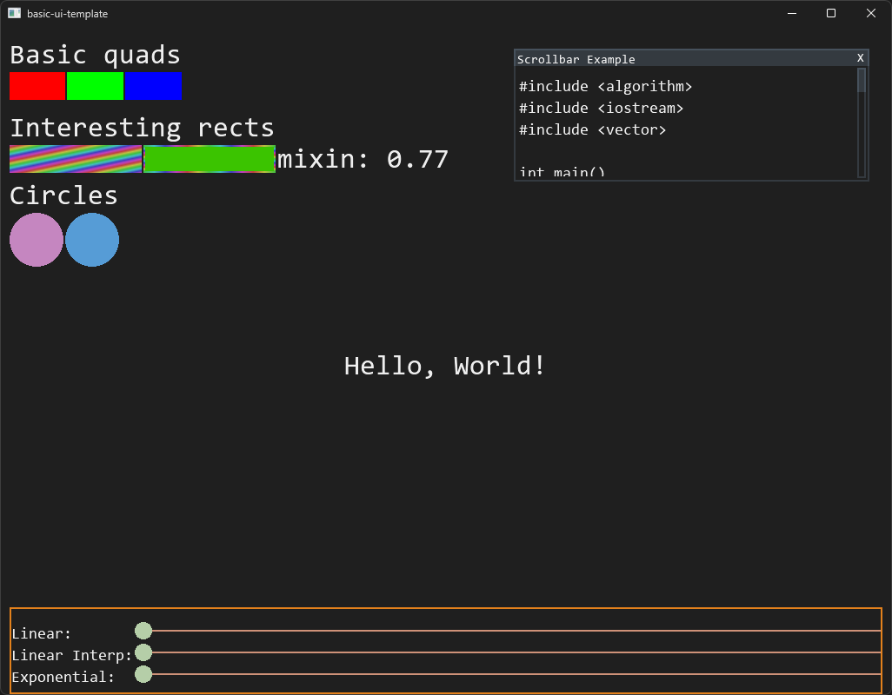

# Basic UI Template

**_Basic UI Template_** is a small rendering framework for building simple 2D UIs.

### Major Features
- Basic window creation / theming.
- Simple primitives renderer (squares, circles, etc.).
- Simple batch renderer.
- Performant font rendering via [Freetype](https://freetype.org/) with UTF-8 support.
- TOML config-driven behavior / UI coloring.
- Simple widgets for displaying data: Window, scrollbox, textbox.

---



## Quick Start

This is streamlined primarily for Visual Studio 2022.

Open an x64 developer command prompt.
```batch
$ git clone https://github.com/cdacamar/basic-ui-template && cd basic-ui-template
$ git submodule init && git submodule update
$ mkdir build && cd build
$ cmake .. -DCMAKE_TOOLCHAIN_FILE="%VCPKG_ROOT%\scripts\buildsystems\vcpkg.cmake"
$ msbuild basic-ui-template.vcxproj
$ Debug\basic-ui-template
```

## High Level Documentation

This basic UI framework contains only primitives from which higher level systems must be built.  One good example is that there's no widget hierarchy provided, it is up to the app to build a sensible hierarchy which can process OS events properly.  In the template, the `main` function is responsible for processing all UI events, but should be replaced if building a real application.

A very simple way to create a scrollable text window:

```c++
UI::Widgets::BasicWindow window; // Window container.
UI::Widgets::ScrollBox scroll;   // Inner scroll box.
UI::Widgets::BasicTextbox text;  // Content.

// Set some text.
text.text("Hello, world!");

// Setup the scroll view.
scroll.content_size(text.content_size(atlas)); // Note: atlas is provided at a higher level.

// Setup window.
window.title("Example Window");

// We can then render them in sequence.
window.render(..., window_viewport);
auto scroll_viewport = window.content_viewport(window_viewport);
scroll.render(..., scroll_viewport);
auto text_viewport = scroll.content_viewport(scroll_viewport);
text.offset(scroll.position());
text.render(..., text_viewport);
```

Handling OS events can be done via basic APIs (as available) on the widgets themselves:

```c++
auto result = window.mouse_down(ui_state, mouse_pos, window_viewport);
if (result.area == UI::Widgets::WindowMouseArea::Content)
{
    auto scroll_viewport = window.content_viewport(window_viewport);
    scroll.mouse_down(ui_state, current_mouse, scroll_viewport);
}
```

Again, a higher level system should replace hard-coded paths with a hierarchy in order to layer widgets.

## License

The project is available under the [MIT](https://opensource.org/licenses/MIT) license.